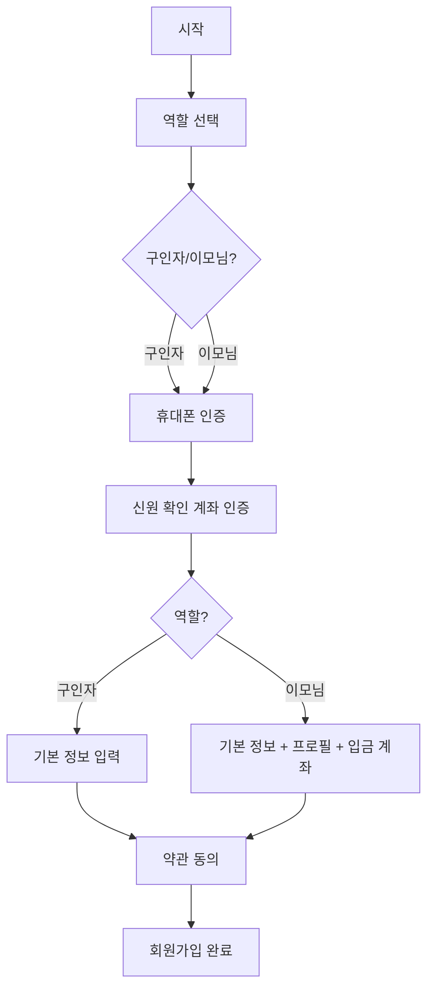
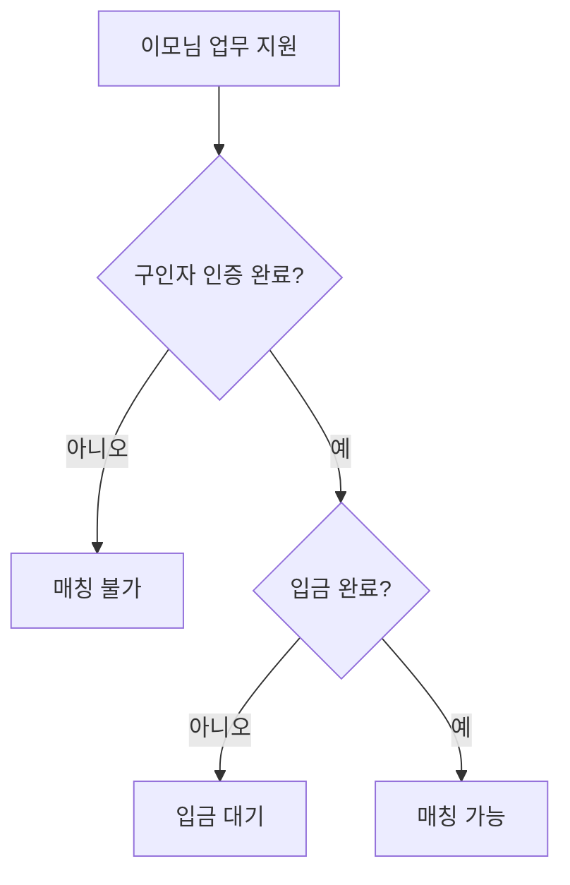

# 인증 및 보안 가이드

이모~여기! 서비스의 신뢰와 안전을 위한 인증 체계

## 1. 사용자 유형별 인증 요구사항

### 1.1 구인자 (고용자)

| 인증 항목 | 필수 여부 | 인증 방법 | 목적 |
|-----------|----------|-----------|------|
| 휴대폰 본인 인증 | ✅ 필수 | SMS 인증 코드 (6자리) | 본인 확인, 연락처 확보 |
| 신원 확인 | ✅ 필수 | 휴대폰 번호 + 입금 계좌 일치 | 범죄 예방, 신뢰 확보 |
| 이용약관 동의 | ✅ 필수 | 체크박스 동의 | 법적 권리 명시 |
| 개인정보 처리방침 동의 | ✅ 필수 | 체크박스 동의 | 개인정보 보호 |
| 입금 계좌 등록 | ✅ 필수 | 계좌번호, 예금주 | 업무 실행 전 선입금 확인 |

### 1.2 이모님 (공급자)

| 인증 항목 | 필수 여부 | 인증 방법 | 목적 |
|-----------|----------|-----------|------|
| 휴대폰 본인 인증 | ✅ 필수 | SMS 인증 코드 (6자리) | 본인 확인, 연락처 확보 |
| 신원 확인 | ✅ 필수 | 휴대폰 번호 + 입금 계좌 일치 | 범죄 예방, 신뢰 확보 |
| 프로필 사진 | ✅ 권장 | 얼굴 사진 업로드 | 신뢰도 향상 |
| 출생년도 | ✅ 필수 | 숫자 입력 (1950~2010) | 연령 확인 |
| 이용약관 동의 | ✅ 필수 | 체크박스 동의 | 법적 권리 명시 |
| 개인정보 처리방침 동의 | ✅ 필수 | 체크박스 동의 | 개인정보 보호 |
| 근로계약서 동의 | ✅ 필수 | 전자 서명 | 근로기준법 준수 |
| 입금 계좌 등록 | ✅ 필수 | 은행명, 계좌번호, 예금주 | 정산 계좌 확보 |

---

## 2. 인증 방법 상세

### 2.1 휴대폰 본인 인증 (SMS)

**절차:**
1. 사용자가 휴대폰 번호 입력 (010XXXXXXXX 형식)
2. 서버에서 6자리 무작위 코드 생성
3. SMS로 인증 코드 발송
4. 사용자가 수신한 코드 입력
5. 코드 일치 시 인증 완료 (유효기간: 5분)

**구현 가이드:**
```python
# 백엔드: 인증 코드 생성 및 발송
code = f"{random.randint(100000, 999999)}"
expires_at = datetime.utcnow() + timedelta(minutes=5)
# SMS 발송 (NCP SENS, Alibaba Cloud 등)
```

**보안 고려사항:**
- 인증 코드는 1회용으로 사용 후 무효화
- 동일 번호로 1일 5회로 발송 제한
- 코드 입력 오류 3회 초과 시 재발송 필요

### 2.2 신원 확인 (휴대폰 + 계좌 일치)

**절차:**
1. 휴대폰 인증 완료 후 본인 명의 계좌번호 입력
2. 서버에서 계좌 주인 확인 API 호출 (은행 API 또는 제3서비스)
3. 휴대폰 번호와 계좌 소유자 일치 시 인증 완료

**구현 가이드:**
```python
# 백엔드: 신원 확인 로직
async def verify_identity(phone: str, account_number: str):
    # 1. 계좌 주 조회 (은행 API)
    account_owner = await bank_api.get_account_holder(account_number)

    # 2. 휴대폰 인증 정보 확인
    phone_owner = await get_verified_phone_owner(phone)

    # 3. 일치 여부 확인
    if account_owner.name == phone_owner.name:
        return {"verified": True}
```

**구현 옵션:**
- **NICE 평가정보**: 본인确认 API
- **KISA**: 전자서명 인증
- **은행 직접 연동**: 각 은행 Open API 활용

### 2.3 입금 계좌 확인 (구인자)

**절차:**
1. 구인자가 입금할 계좌 정보 등록
2. 업무 생성 전 입금 완료 확인
3. 입금이 확인된 업무만 매칭 가능

**구현 가이드:**
```python
# 백엔드: 입금 확인
async def check_deposit(task_id: UUID):
    task = await get_task(task_id)
    if not task.is_deposit_paid:
        raise HTTPException(
            status_code=403,
            detail="업무 실행 전 입금이 필요합니다"
        )
```

### 2.4 근로계약서 동의 (이모님)

**절차:**
1. 회원가입 시 근로계약서 내용 표시
2. 필수 항목 동의 체크
3. 전자 서명 또는 체크박스로 동의 확정

**근로계약서 포함 항목:**
- 근로 장소, 업무 내용
- 근로 시간, 휴게 시간
- 임금 및 지급 방법
- 기타 근로 조건

---

## 3. 인증 플로우

### 3.1 회원가입 인증 플로우



### 3.2 업무 매칭 전 인증 확인



---

## 4. 개발 체크리스트

### Phase 1: 기본 인증
- [ ] 휴대폰 인증 코드 생성 및 발송
- [ ] 인증 코드 검증 및 만료 처리
- [ ] 인증 상태 DB 저장
- [ ] 회원가입 시 인증 확인 로직

### Phase 2: 신원 확인
- [ ] 계좌 주 확인 API 연동
- [ ] 휴대폰-계좌 일치 검증
- [ ] 인증 실패 시 처리 로직
- [ ] 재인증 기능 구현

### Phase 3: 입금 확인
- [ ] 입금 계좌 등록 기능
- [ ] 입금 확인 API (가상계좌 또는 실시간)
- [ ] 입금 완료 플래그 관리
- [ ] 미입금 업무 필터링

### Phase 4: 약관 동의
- [ ] 이용약관 내용 표시
- [ ] 개인정보 처리방침 내용 표시
- [ ] 근로계약서 내용 표시 (이모님)
- [ ] 동의 여부 DB 저장

---

## 5. 보안 정책

### 5.1 인증 정보 보관
- 인증 코드는 평문 저장하지 않음 (해시 추천)
- 만료된 인증 정보는 자동 삭제
- 로그에 민감한 정보 불포함

### 5.2 인증 실패 처리
- 연속 실패 3회: 계정 잠금 (10분)
- 1일 인증 실패 5회: 당일 인증 제한
- 의심 활동 감지: 추가 인증 요구

### 5.3 인증 세션 관리
- 액세스 토큰: 30분 유효
- 리프레시 토큰: 7일 유효
- 로그아웃 시 토큰 즉시 무효화

---

## 6. 법적 참고사항

### 6.1 근로기준법 준수
- 근로계약서 작성 의무 (이모님)
- 임금 체불 방지 (입금 확인)
- 휴게 시간 보장

### 6.2 개인정보보호법
- 개인정보 수집 시 동의 필수
- 수집 목적 외 사용 금지
- 정보 제3자 제공 시 추가 동의

### 6.3 전자금융거래법
- 전자서명 인증 권장
- 금융 거래 내역 보관

---

## 7. 외부 서비스 연동 가이드

### 7.1 SMS 발송 서비스 추천
| 서비스 | 특징 | 비고 |
|--------|------|------|
| NCP SENS | 국내, 안정적 | 삼성정보통신 |
| Alibaba Cloud | 저렴, 해외 | 중국 |
| Twilio | 글로벌 | 미국 |

### 7.2 본인 확인 API 추천
| 서비스 | 특징 | 비고 |
|--------|------|------|
| NICE 평가정보 | 다양한 인증 방법 | 본인확인 API |
| KISAuth | 간편 인증 | 한국신용정보 |
| 코나아이 | 안면 인증 | 삼성SDS |

---

*이 문서는 보안 및 신뢰성을 최우선으로 고려하여 작성되었습니다. 실제 구현 시 법무팀과 협의하여 갱신하세요.*
